基于 Spring Boot 的餐厅点餐系统（程序）
=

### 完整代码获取地址：从戎源码网 ([https://armycodes.com/](https://armycodes.com/))
### 作者微信：19941326836  QQ：952045282 
### 承接计算机毕业设计、Java毕业设计、Python毕业设计、深度学习、机器学习
### 选题+开题报告+任务书+程序定制+安装调试+论文+答辩ppt 一条龙服务
### 所有选题地址https://github.com/nature924/allProject

一、项目介绍
---

餐厅点餐系统。系统角色为管理员（后台）、商家（shangjia）和普通用户（yonghu），主要功能如下：

管理员（后台）
基本操作：登录、修改密码、获取/修改个人信息、登出
系统管理：系统配置、文件管理（上传/下载）、日志查看
菜品管理：菜品分类 CRUD、菜品信息 CRUD、分页列表、详情、智能排序、点击统计
订单管理：菜品订单 CRUD、分页/筛选、详情、提醒统计
餐桌管理：餐桌 CRUD、分页、详情
资讯管理：菜品资讯 CRUD（富文本编辑）、列表/详情
评论/评价管理：查看/删除/回复用户评价与讨论
收藏管理：查看/删除用户收藏
报表/图表展示（统计、echarts 支持）

商家（shangjia）
基本操作：登录、修改密码、获取/修改个人信息、登出
店铺业务：仅对自己店铺的菜品/分类进行 CRUD、上传图片
订单处理：查看/管理本店订单（接单、更新状态）
餐桌管理：本店餐桌维护
资讯与评论：发布/管理店铺相关资讯，查看/回复评论

普通用户（yonghu）
账户：注册、登录、修改密码、获取 session 信息、登出
浏览与交互：查看菜品分类、菜品列表与详情、资讯列表与详情、智能排序与搜索
购物行为：添加下单（菜品订单）、查看/管理个人订单
社交功能：收藏菜品、发表评论/评分、查看评论

二、项目技术
---
- 编程语言：Java
- 数据库：MySQL
- 项目管理工具：Maven
- 前端技术：VUE、HTML、Jquery、Bootstrap
- 后端技术：Spring、SpringMVC、MyBatis

三、运行环境
---
- 操作系统：Windows、macOS都可以
- JDK版本：JDK1.8以上都可以
- 开发工具：IDEA、Ecplise、Myecplise都可以
- 数据库: MySQL5.7以上都可以
- Tomcat：任意版本都可以
- Maven：任意版本都可以

四、运行截图
---

### 程序截图：
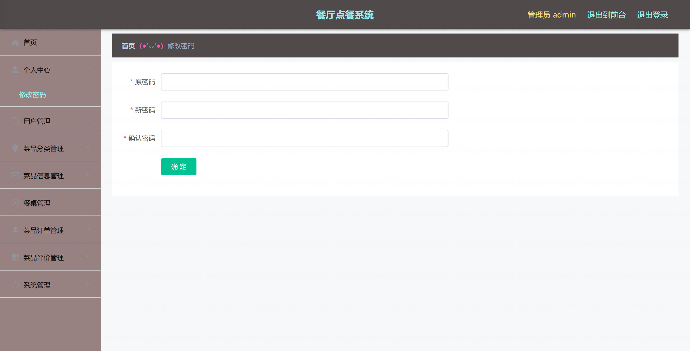
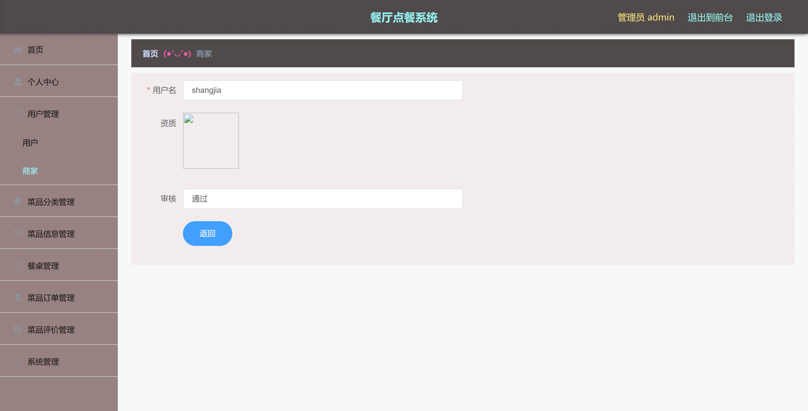
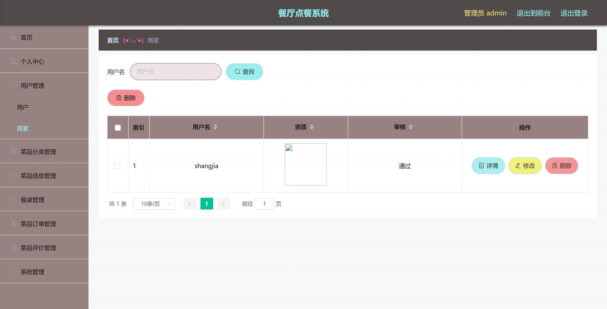
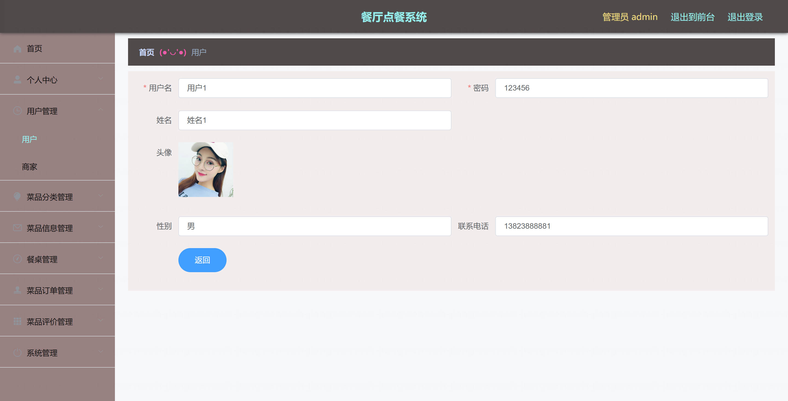
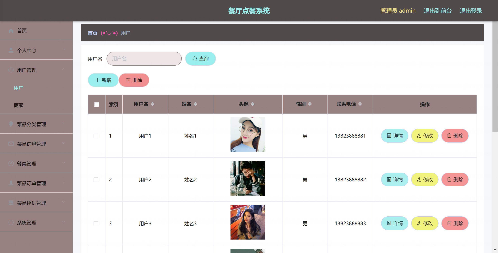
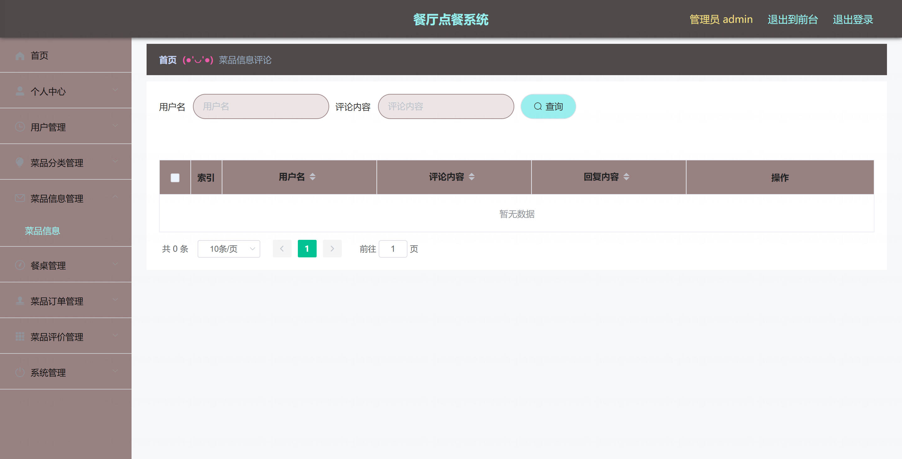
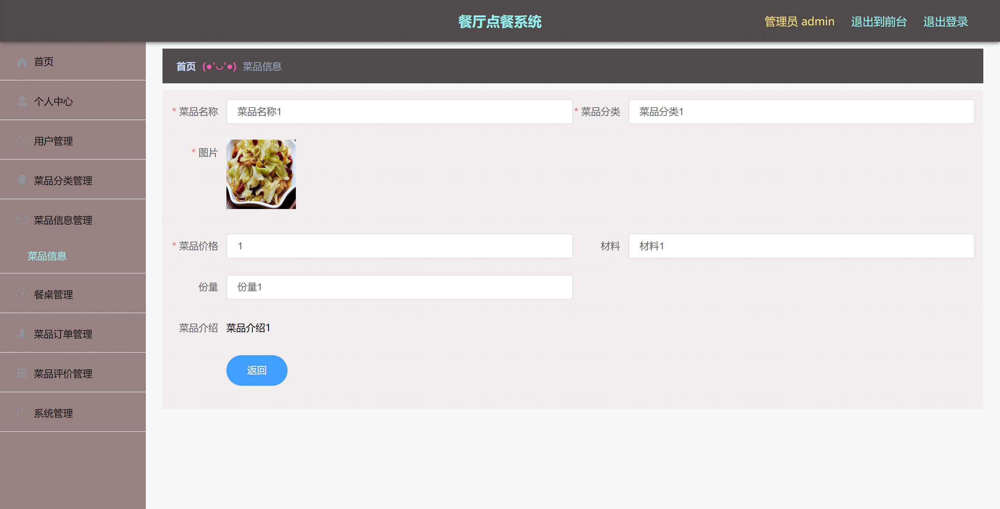
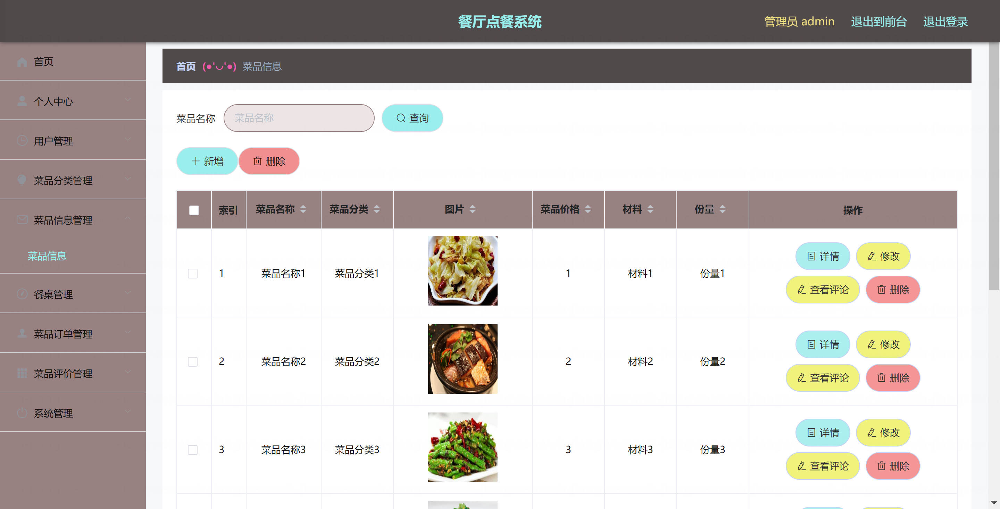
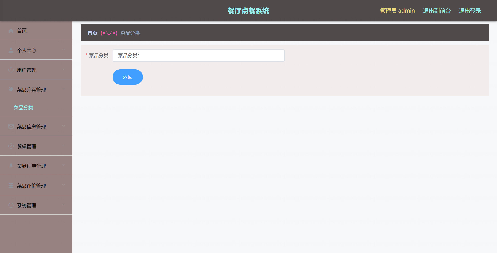
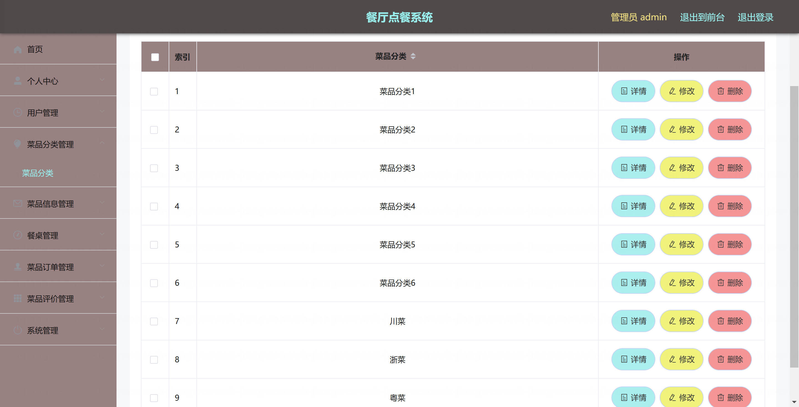
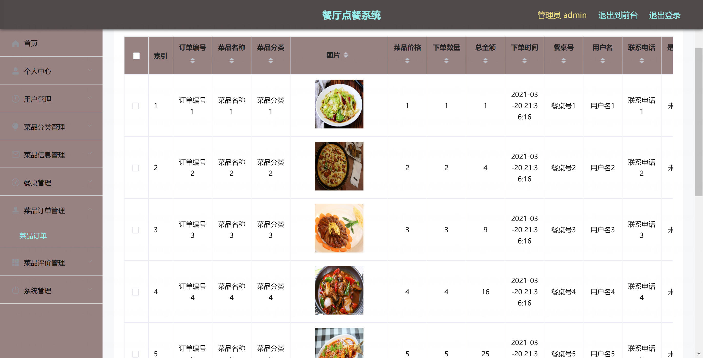

